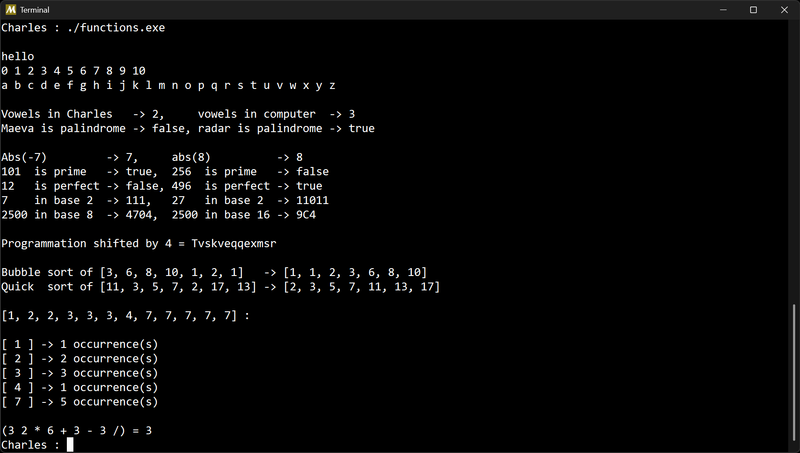

# Atelier Fonctions

## Présentation

L'objectif de cet atelier est d'implémenter quelques fonctions pour se familiariser avec l'algorithmique
en posant des contraintes sur l'écriture des fonctions.

Les fonctions à écrire sont les suivantes :

- La fonction `hello` affiche "hello" à l'écran avec la fonction print.
- La fonction `print_numbers` affiche les nombres de 0 à n avec une boucle for.
- La fonction `print_alphabet` affiche l'alphabet en minuscules avec une boucle for.
- La fonction `count_vowels` compte les voyelles dans un mot donné avec une boucle for.
- La fonction `is_palindrome` vérifie si un mot est un palindrome avec une seule boucle while.
- La fonction `nb_abs` retourne la valeur absolue d'un entier avec une ternaire.
- La fonction `is_prime` détermine si un entier est premier.
- La fonction `is_perfect` détermine si un entier est parfait.
- La fonction `to_binary` convertit un entier en représentation binaire.
- La fonction `to_base` convertit un entier dans une base donnée entre 2 et N.
- La fonction `cesar_cipher` chiffre une chaîne par décalage de César.
- La fonction `bubble_sort` trie une liste en utilisant le tri à bulles avec deux boucles imbriquées.
- La fonction `quick_sort` trie une liste en utilisant l'algorithme de tri rapide récursif.
- La fonction `nb_occurrences` compte les occurrences de chaque élément d'un tableau en utilisant une seule boucle.
- La fonction `postfix` évalue une expression en notation postfixée en utilisant une pile comme structure de données.

Le programme est écrit en langage C et compilé avec GCC.

## Aperçu

Exemple d'exécution du programme :

## Auteur

© Charles Theetten. Tous droits réservés.

##
