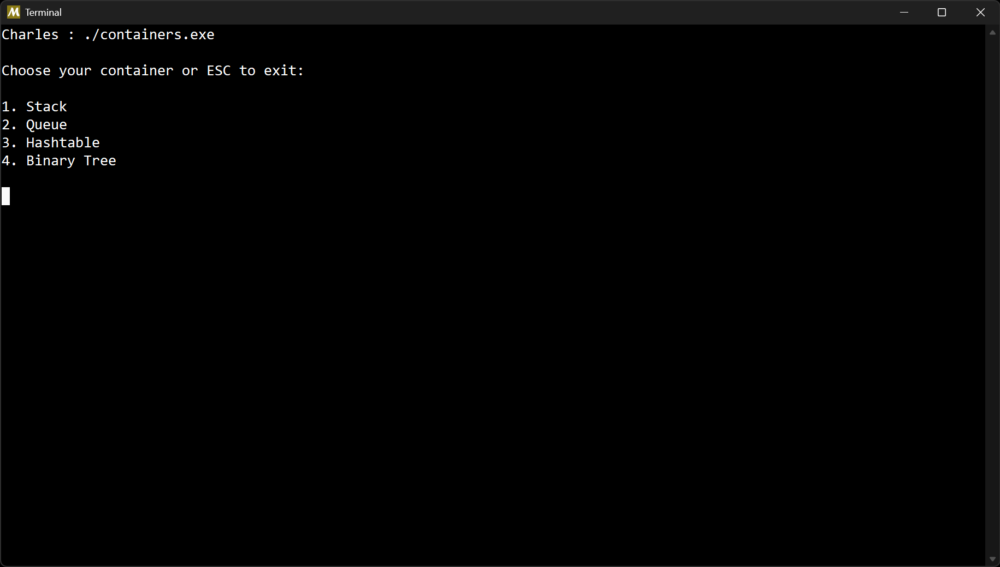
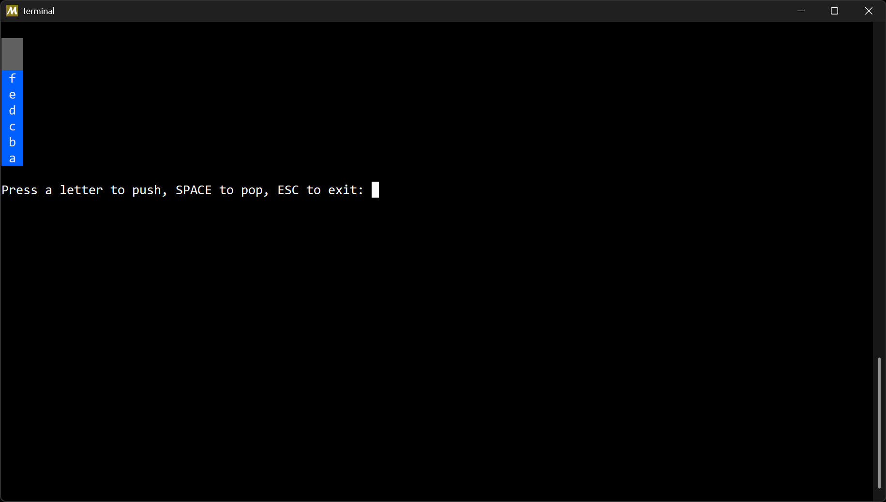
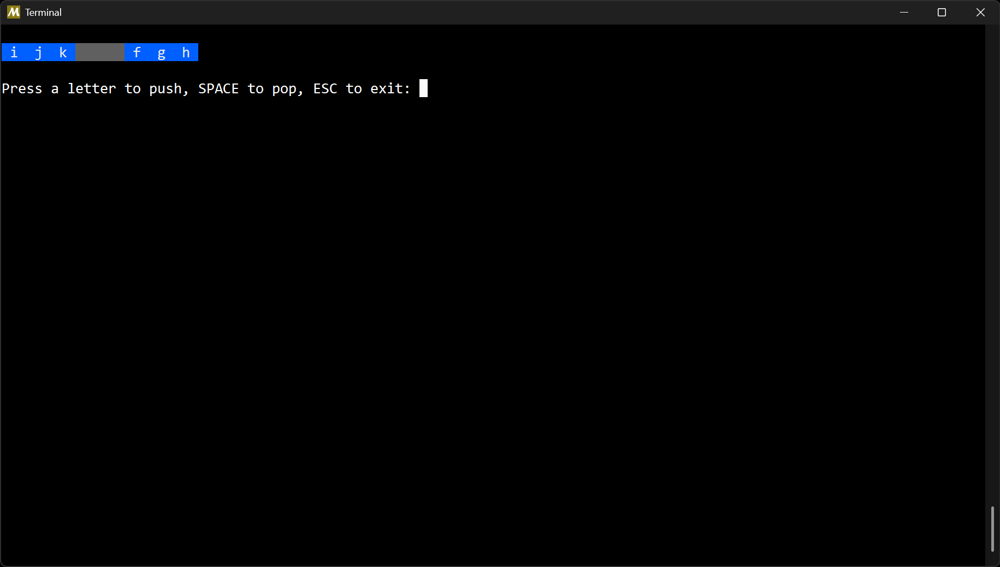
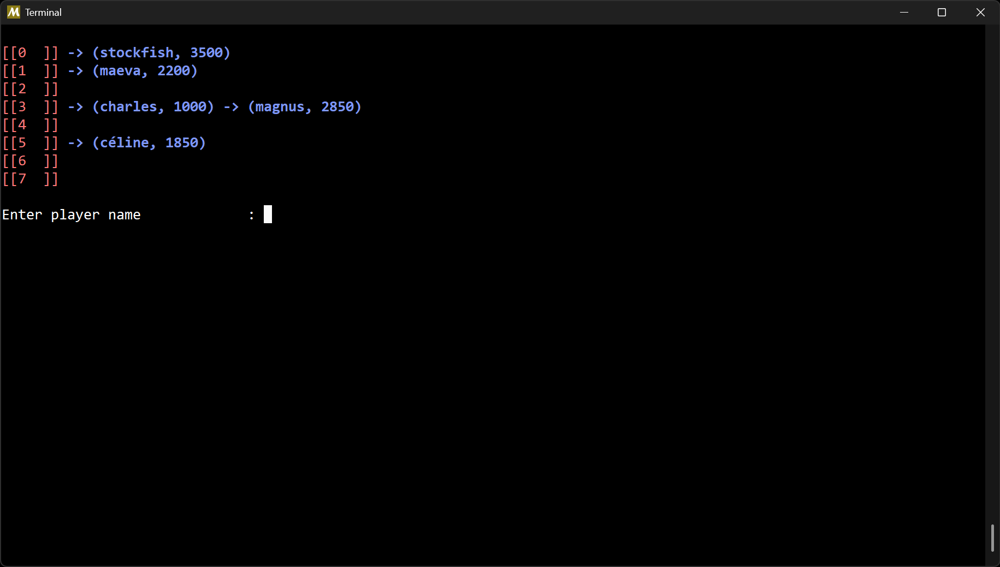
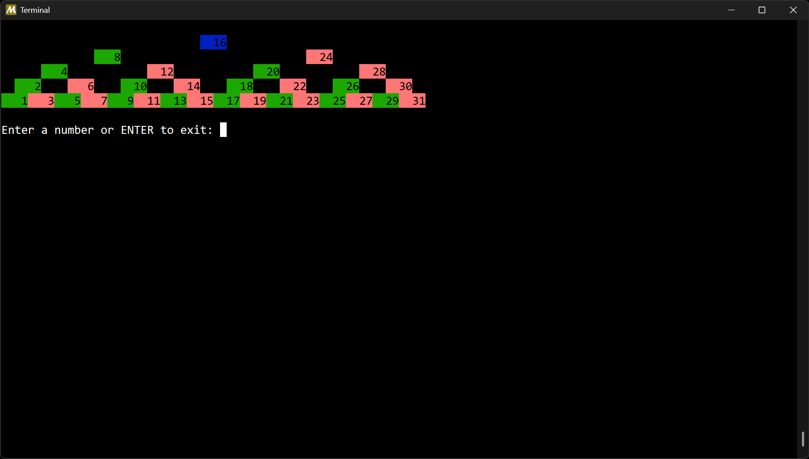

# Atelier Conteneurs

## Présentation

L'objectif de cet atelier est d'implémenter certains conteneurs représentant des
structures de données présentes dans un grand nombre d'algorithmes et utilisées
dans un nombre très important de programmes.

Les structures implémentées sont les suivantes :

 - `La pile` fournit les primitives pour empiler et dépiler des données dans un tableau.
 - `La file` fournit les primitives pour ajouter et retirer des données dans un buffer circulaire.
 - `La table de hachage` fournit les primitives pour ajouter des joueurs d'échecs (nom + elo) dans une table chaînée.
 - `L'arbre binaire` fournit les primitives pour ajouter des éléments dans l'arbre sous la contrainte d'un prédicat.

Le programme est écrit en C et compilé avec GCC.

## Aperçu

Exemple d'exécution du programme :

## Auteur

© Charles Theetten. Tous droits réservés.

##
