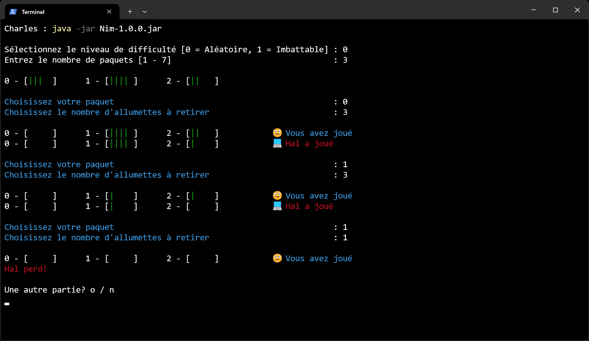
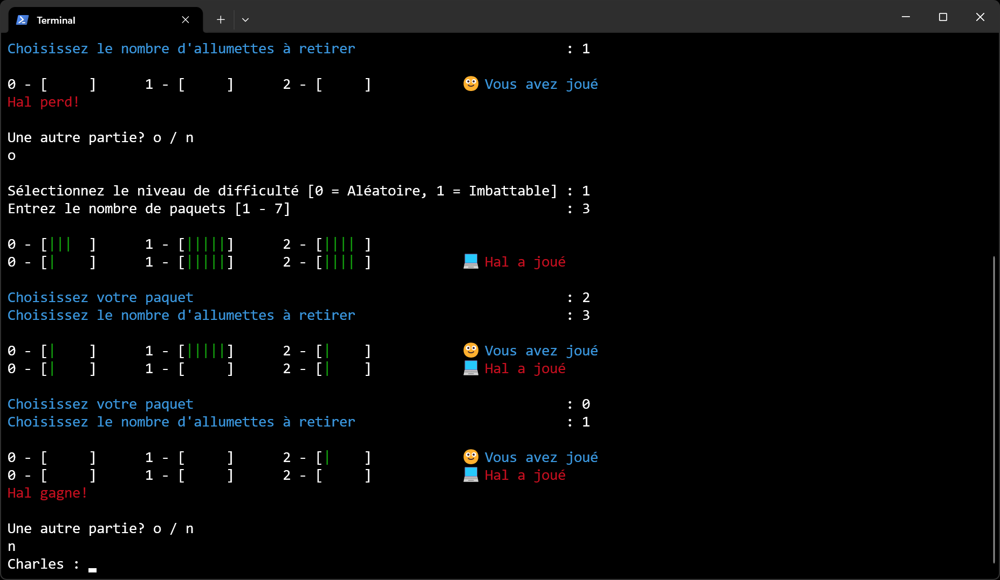

# Jeu de Nim

## Présentation

L'objectif de ce projet est de fournir une implémentation fonctionnelle du jeu de Nim.

Les fonctionnalités sont les suivantes :

- Jeu en mode console avec interface textuelle
- Génération aléatoire des paquets
- Stratégie aléatoire ou gagnante
- Possibilité de rejouer plusieurs parties

Le programme est écrit en Java. La construction et le déploiement se font via Gradle.

## Aperçu

Exemple d'exécution du programme :

## Auteur

© Charles Theetten. Tous droits réservés.

##
