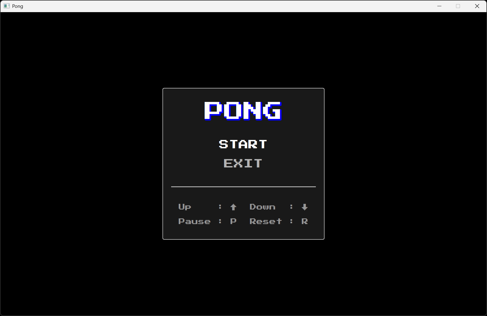

# Jeu du Pong

## Présentation

L'objectif de ce projet est de fournir une implémentation fonctionnelle du jeu vidéo Pong.

Les fonctionnalités sont les suivantes :

- Menu principal avec options START et EXIT
- Touche (P) pour PAUSE, (R) pour RESET
- Touches fléchées pour le déplacement de la raquette
- Incrémentation du score à chaque rebond réussi
- Effet sonore lors du rebond sur la raquette du joueur
- Collision avec angle variable selon la position d'impact
- Accélération progressive de la balle
- Suivi parfait de la balle par l'ordinateur

Le programme est écrit en Java. La construction et le déploiement se font via Gradle.

## Aperçu

Exemple d'exécution du programme :

## Auteur

© Charles Theetten. Tous droits réservés.

##
