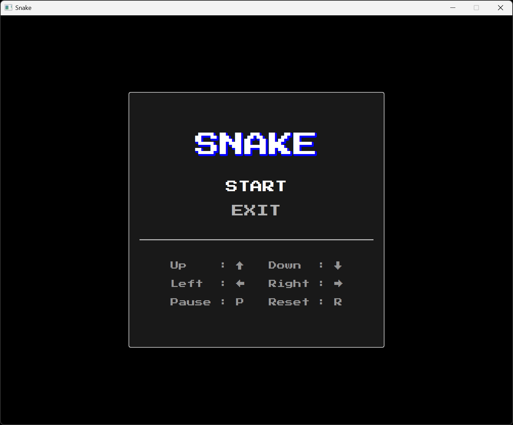
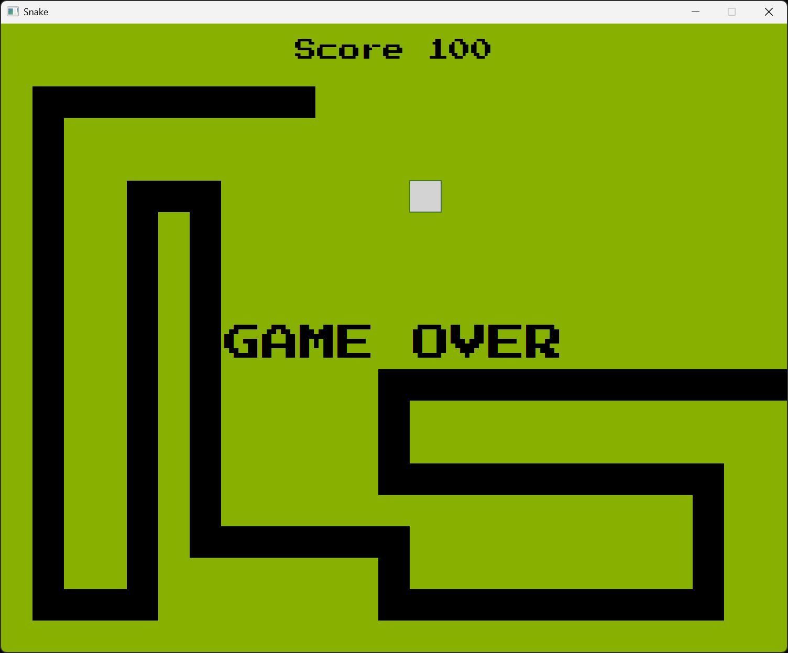

# Jeu du Snake

## Présentation

L'objectif de ce projet est de fournir une implémentation fonctionnelle du jeu vidéo Snake.

Les fonctionnalités sont les suivantes :

- Menu principal avec options START et EXIT
- (P) pour PAUSE, (R) pour RESET
- Touches fléchées pour les déplacements du serpent
- Incrémentation du score à chaque repas
- Effet sonore lors de la prise de nourriture
- Gestion des collisions avec les bords et la queue
- Système de croissance du serpent quand il mange
- Génération de nourriture évitant le corps du serpent

Le programme est écrit en Java. La construction et le déploiement se font via Gradle.

## Aperçu

Exemple d'exécution du programme :

## Auteur

© Charles Theetten. Tous droits réservés.

##
