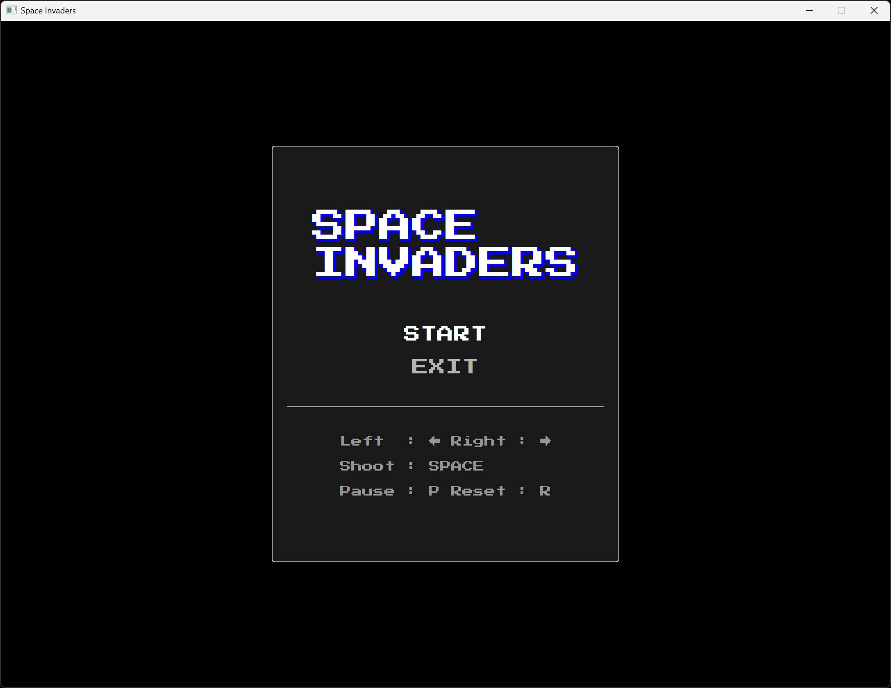
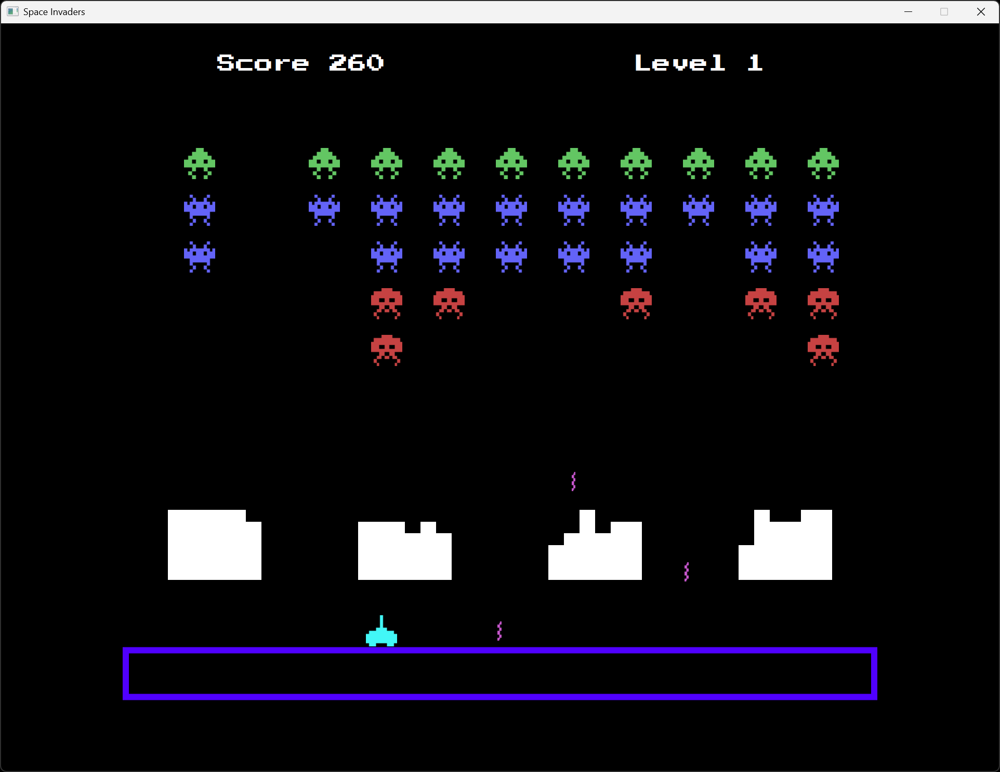

# Jeu du SpaceInvaders

## Présentation

L'objectif de ce projet est de fournir une implémentation fonctionnelle du jeu vidéo SpaceInvaders.

Les fonctionnalités sont les suivantes :

- Menu principal avec options START et EXIT
- Touche (P) pour PAUSE, (R) pour RESET
- Touches fléchées pour le déplacement du vaisseau
- Touche ESPACE pour le tir du vaisseau
- Effets sonores pour le tir du joueur et les déplacements ennemis
- Quatre bunkers protecteurs pour le joueur
- Augmentation des tirs ennemis et de leur vitesse selon leur nombre
- Deux niveaux et un niveau de boss

Le programme est écrit en Java. La construction et le déploiement se font via Gradle.

## Aperçu

Exemple d'exécution du programme :

## Auteur

© Charles Theetten. Tous droits réservés.

##
