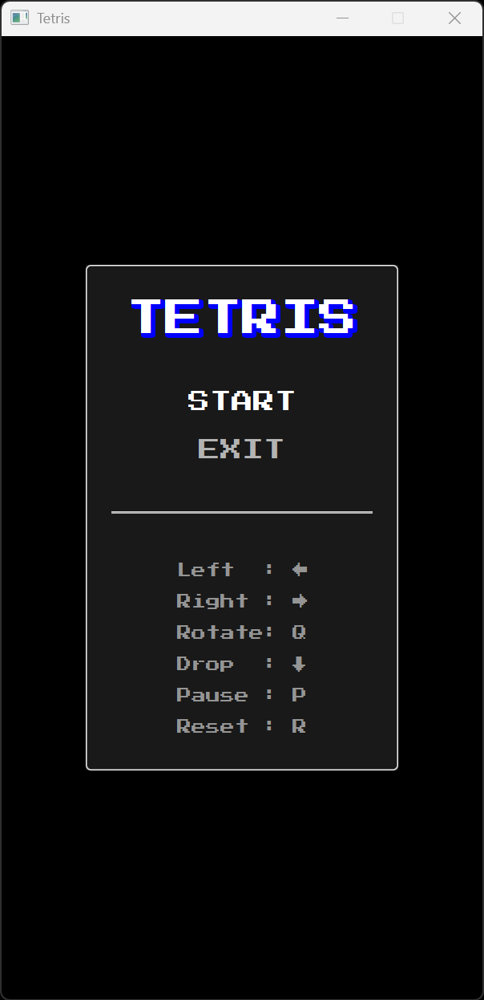
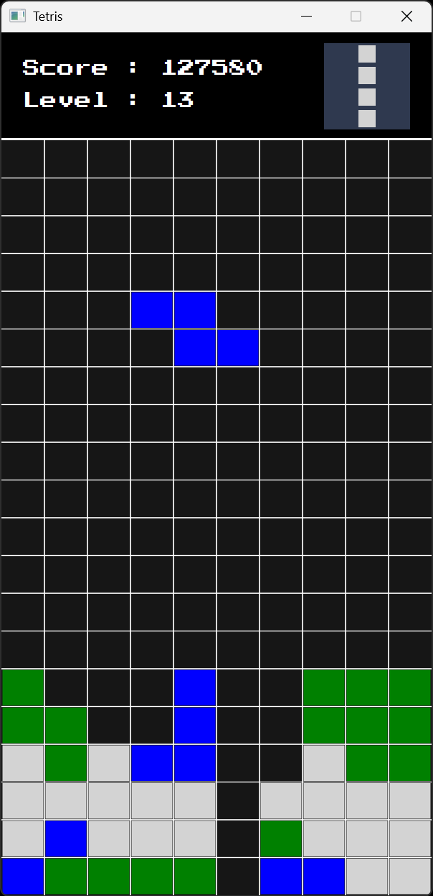

# Jeu Tetris

## Présentation

L'objectif de ce projet est de fournir une implémentation fonctionnelle du jeu vidéo Tetris.

Les fonctionnalités sont les suivantes :

- Menu principal avec options START et EXIT
- Touche (P) pour PAUSE, (R) pour RESET
- Déplacement du Tetromino via les touches fléchées
- Touche (Q) pour la rotation du Tetromino
- Gestion du score basé les règles en vigueur
- Effet sonore lors de la réalisation de lignes
- Possibilité de déplacer le Tetromino après atterissage
- Gestion de plusieurs niveaux de difficulté

Le programme est écrit en Java. La construction et le déploiement se font via Gradle.

## Aperçu

Exemple d'exécution du programme :

## Auteur

© Charles Theetten. Tous droits réservés.

##
