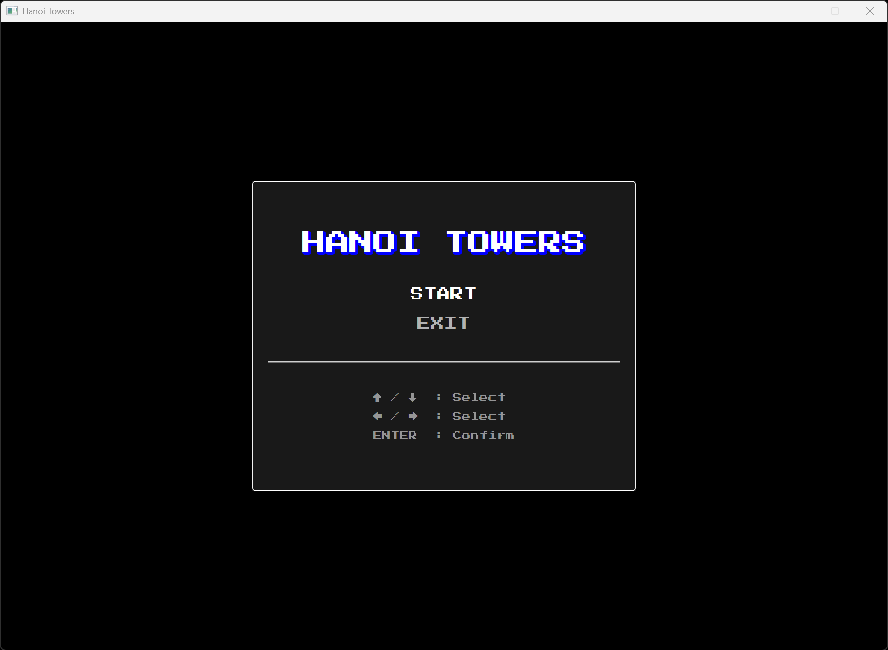
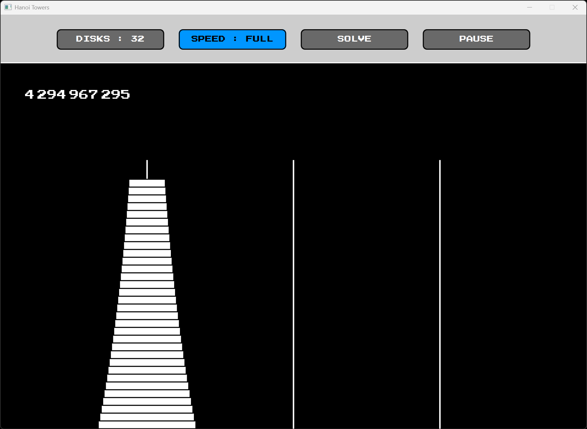

# Jeu des Tours de Hanoï

## Présentation

L'objectif de ce projet est de fournir une implémentation de résolution automatique du jeu des
tours de Hanoï.

Les fonctionnalités sont les suivantes :

- Menu principal avec options START et EXIT
- Touches fléchées pour la sélection des actions
- Sélection du nombre de disques entre 1 et 128
- Affichage du nombre de mouvements restants
- Animation visuelle du déplacement des disques
- Possibilité de mettre en pause et reprendre la résolution
- Réinitialisation automatique au changement d'un paramètre
- Contrôle de la vitesse d'exécution du thread récursif

Le programme est écrit en Java. La construction et le déploiement se font via Gradle.

## Aperçu

Exemple d'exécution du programme :

## Auteur

© Charles Theetten. Tous droits réservés.

##
