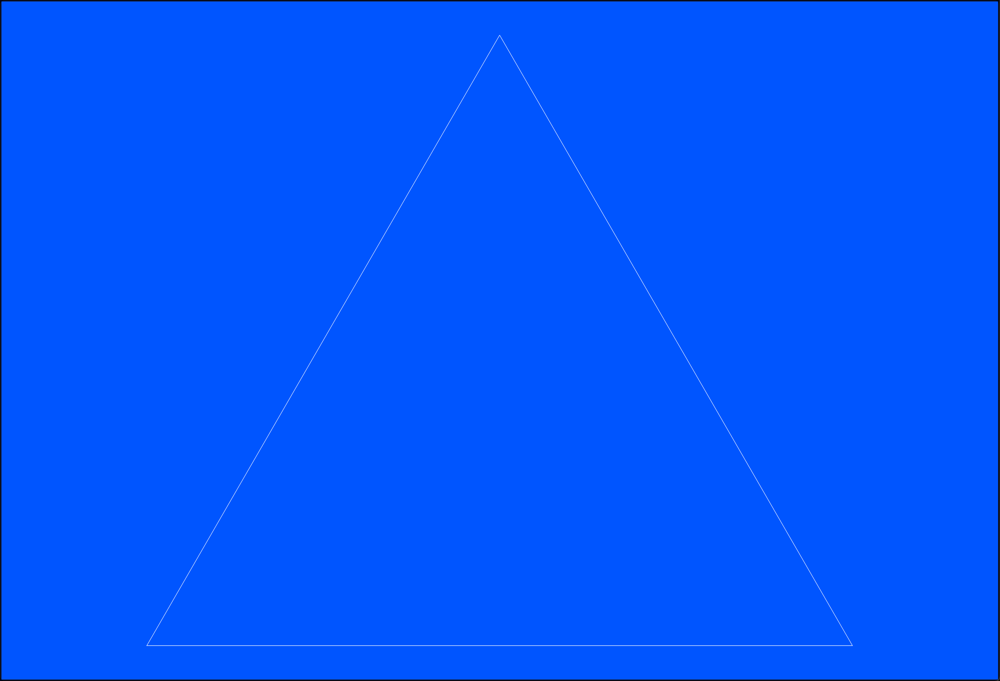
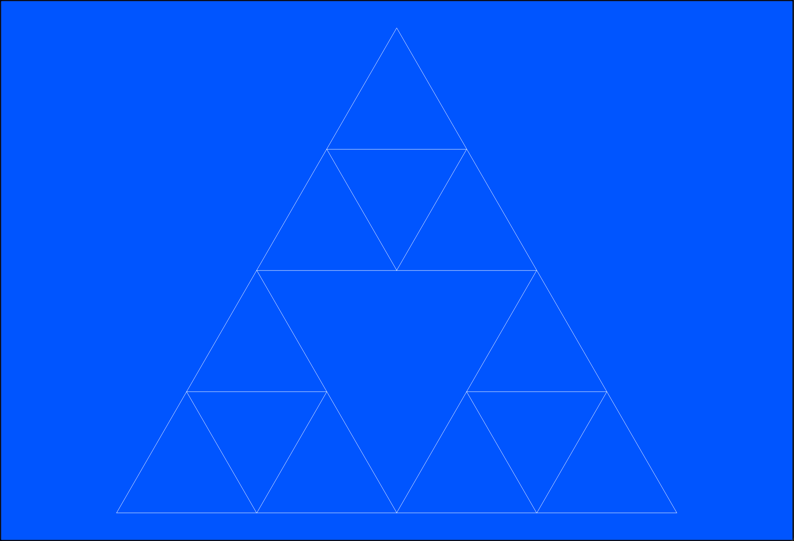
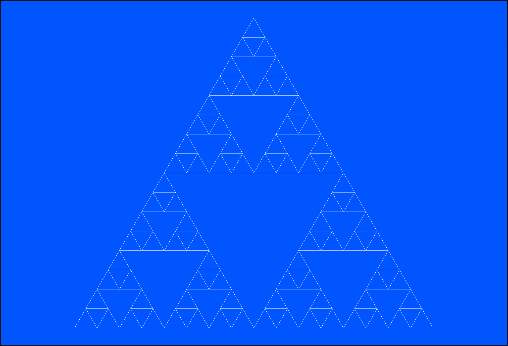
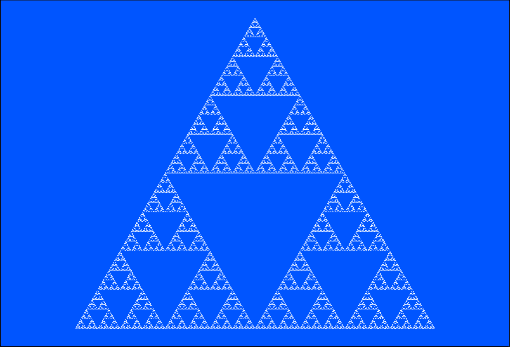

# Simulation du Triangle de Sierpinski

## Présentation

L'objectif de cette simulation est de proposer une construction et une visualisation
de la fractale du triangle de Sierpinski.

Les fonctionnalités sont les suivantes :

- Définition du nombre d'itérations de la figure
- Définition du délai pour l'affichage dynamique
- Affichage du statut de la simulation en cours
- Calcul du nombre total de segments du triangle
- Visualisation dynamique ou instantanée du résultat

Le programme est écrit en Python et lancé via l'interpréteur.

## Aperçu

Exemple de captures du rendu :

<table>
    <tr>
        <td></td>
        <td></td>
    </tr>
    <tr>
        <td></td>
        <td></td>
    </tr>
</table>

## Auteur

© Charles Theetten. Tous droits réservés.

##
